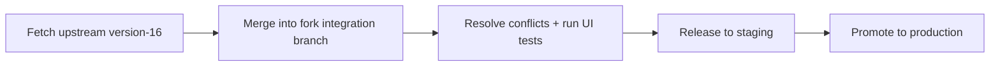

# Pattern 04: Fork + Sync Strategy (Heavy Customization)

## WHAT
Maintain a fork of the target Frappe UI app (CRM/LMS), apply your changes in the fork, and periodically sync upstream.

## WHEN
- You need many deep UI changes across routes/components/stores.
- Overlay patch count keeps growing and breaking each release.
- Team can sustain merge and release discipline.

## WHY
- Full control over frontend architecture and UX.
- Cleaner than extreme monkey-patching.
- Predictable release process when governed well.

## HOW

### 1) Configure app source to your fork

```bash
bench get-app crm https://github.com/<your-org>/crm.git --branch version-16
```

### 2) Keep an upstream remote in your fork workflow

```bash
git remote add upstream https://github.com/frappe/crm.git
git fetch upstream
```

### 3) Sync cadence (example)



### 4) Governance checklist

- Track all custom commits under feature flags where possible.
- Keep fork delta documented by module.
- Automate regression checks before every sync release.
