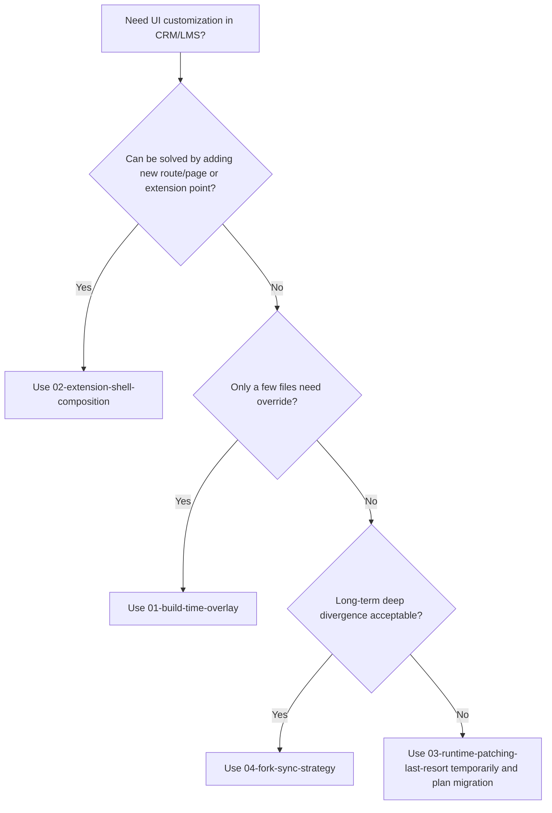

# Frappe v16+ UI Override Patterns (Vue)

This repository documents practical patterns to customize **Frappe UI-based apps** (CRM, LMS, etc.) on **Frappe v16+**.

## Is the old `crm_override` method still relevant?

**Short answer: yes, but only as a controlled fallback.**

The old method (copy app `frontend/src` + overwrite selected files during build) can still work in v16+ if paths and build pipeline are compatible. But it is brittle against upstream refactors and should not be your first option.

## Recommendation Summary

| Pattern | Use level | Best for |
| --- | --- | --- |
| `02-extension-shell-composition` | **Recommended first** | New pages/features with minimal conflict risk |
| `01-build-time-overlay` | **Recommended with guardrails** | Precise component/view overrides |
| `04-fork-sync-strategy` | **Recommended for heavy divergence** | Deep product-level UI rewrites |
| `03-runtime-patching-last-resort` | **Avoid unless blocked** | Emergency, temporary UI adjustments |

## Decision Flow

## Contents

- [01-build-time-overlay](./01-build-time-overlay/README.md)
- [02-extension-shell-composition](./02-extension-shell-composition/README.md)
- [03-runtime-patching-last-resort](./03-runtime-patching-last-resort/README.md)
- [04-fork-sync-strategy](./04-fork-sync-strategy/README.md)

## Final Recommendation

For Frappe v16+, prefer this order:

1. **Compose/extend first** (`02`)
2. **Overlay only required files** (`01`)
3. **Fork when business requires major UI divergence** (`04`)
4. **Use runtime patching only as temporary debt** (`03`)
